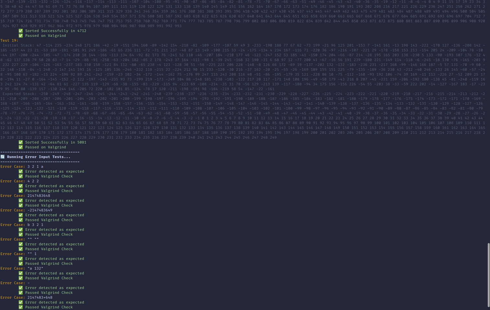

  <h1 id="push_swap">push_swap</h1>
  
A polished push_swap rendition with built-in automation, fine-grained move optimisation, and a self-contained evaluation harness.

  <strong>Index</strong>
   
  <a href="#about">About</a> • <a href="#custom-tester">Custom Tester</a> • <a href="#results-reporting">Results & Reporting</a> • <a href="#subject-compliance">Subject Compliance</a> • <a href="#repository-layout">Repository Layout</a> • <a href="#build-integration">Build & Integration</a> • <a href="#usage-guidelines">Usage Guidelines</a> • <a href="#conversions-features">Conversion & Feature Matrix</a> • <a href="#flags-features">Flags & Instruction Handling</a> • <a href="#internal-architecture">Internal Architecture</a> • <a href="#tester-workflow">Tester Workflow</a> • <a href="#related-projects">Related Projects</a> • <a href="#credits">Credits</a>

## About
- `push_swap` orchestrates sorting by measuring `ft_lst_size_ps` and dispatching small decks to `sort_small` while large decks flow through chunk ingestion (`push_chunks_to_b`) and cost-driven reinsertion (`sort_large`), all while recording each move in the bounded `t_ops` journal (`MAX_OPS`).
- The stack primitives and heuristics stay in-house: Libft (`libft/`), `ft_printf_bonus`, and `get_next_line_bonus` supply memory-safe utilities, so no external dependencies are required during evaluation.
- Optimisation happens automatically; once the raw plan is generated, `optimize_moves` fuses redundant rotations, opposing pushes, and disjoint swaps via the `clean_*` passes before `print_final_moves` emits the canonical instruction script.
- Resilience is baked in: early exits for already sorted inputs, aggressive memory sanitation in `free_lists`, and per-node flags (`above_median`, `cheapest`, `target_node`) make the algorithm predictable under stress.

## Custom Tester
- `tester` (built with `make tester`) links against the same list, parsing, and operation objects as the main binary, ensuring every validation run uses identical semantics for `parse_args`, `apply_move`, and the instruction dispatch.
- The harness accepts the planned sequence on `stdin`, streams it through `get_next_line`, and either mirrors the official `checker` success path or dumps the residual stack via `print_stack`, giving an immediate view of the misplaced nodes.
- Error handling is mirrored: invalid mnemonics trigger an `Error`, `get_next_line(-1)` flushes static buffers, and the stacks are cleaned via `ft_lst_clear_ps` before exit.
- Pair the executable with `test_checker.txt` to mirror canonical cases, compare behaviour with `checker_linux`, and assert that invalid mnemonics short-circuit with `Error` exactly once.

## Results & Reporting
- Aggregated console logs and leak summaries are stored in `results/test_results.txt`, making it easy to attach or review evidence after a long test run.
- Status lines follow a predictable pattern (emoji + colour) so regressions stand out during CI demos or peer reviews.
- The tester screenshots below capture the automation loop in action, including the checker comparison and Valgrind report:

<table>
  <tr>
    <td></td>
    <td></td>
  </tr>
  <tr>
    <td colspan="2" align="center"><em>Running tester & showcasing results at a glance</em></td>
  </tr>
</table>

## Subject Compliance
- Argument intake follows the PDF subject: `parse_args` accepts compact or spaced inputs, splits them via `ft_split`, rejects blank strings (`ft_isstringempty`), and relies on `check_errors` to flag non-digits, duplicates, and `int` overflow using `ft_atol_ps`.
- Every mandated operation (`sa` through `rrr`) is decoded in `apply_move`; any drift from the subject grammar instantly flushes the reader and emits `Error` on `stderr`, matching the bonus checker expectations.
- The bonus checker enforces the evaluation rules strictly—silence on empty input, `OK` when stack A is sorted and B is empty, `KO` otherwise—with `is_sorted` and pointer checks guarding the final verdict.
- Benchmarks are targeted: chunking and cost heuristics keep 100-value datasets within the subject's reference ceilings, while `MAX_OPS` prevents pathological outputs from slipping through unnoticed.

## Repository Layout
- Root assets: `checker_linux` (official binary), high-level `Makefile`, and canned suites (`test_valid.txt`, `test_error.txt`, `test_checker.txt`) for manual or automated runs.
- `src/` entry points (`push_swap.c`, `checker_bonus.c`, `tester.c`) sit beside modular utilities under `utils/`:
  - `utils/lst/` hosts dedicated list primitives (`ft_lst_new_ps`, `ft_lst_assignindex_ps`, `ft_lst_clear_ps`, etc.).
  - `utils/ops/` implements the 11 stack operations with move logging through `add_move`.
  - `utils/parsing/` handles argument sanitation, conversions, and error messaging.
  - `utils/sorting/` provides small-sort shortcuts, chunk logic, cost evaluation, and move cleanup.
- `docs/` collects the official subject PDF and screenshots for documentation; images reside in `docs/images/`.
- Build artifacts land in `obj/` and `obj_checker/`, while batch test output is archived under `results/`.

## Build & Integration
- `make` clones the private Libft repository on first run, compiles it, and links `push_swap` with `-Wall -Wextra -Werror -g`, isolating objects in `obj/`.
- `make bonus` and `make tester` reuse the same object graph to produce `checker` and `tester`, avoiding duplicate compilation and ensuring consistent instruction semantics across binaries.
- `make test` composes the full QA loop: build everything, iterate `test_valid.txt`, feed each plan into `checker_linux`, count moves with `wc -l`, compute expected orderings via `sort`, and run `valgrind` with `VFLAGS`; summaries are echoed with bold, colourised status lines for rapid scanning.
- `make test_error` focuses on malformed inputs from `test_error.txt`, verifying that every case prints `Error` on `stderr` and remains leak-free under Valgrind.
- Cleaning and recycling stays straightforward: `make clean` removes object directories and executables, `make fclean` also wipes the Libft clone and `results/`, and `make re` forces a pristine rebuild.

## Usage Guidelines
- Generate a plan with `./push_swap 2 1 3 6 5 8` and pipe it into the checker of your choice: `./push_swap ... | ./checker ...` or `./push_swap ... | ./checker_linux ...`.
- Inspect tricky runs by chaining the tester: `./push_swap ... | ./tester ...` prints the post-plan stack before exiting, enabling instant diagnosis of misplaced nodes.
- Replay stored sequences from a file with `./push_swap ... > ops.txt` followed by `cat ops.txt | ./checker ...` to audit or share the instruction script.
- Stay mindful of the `MAX_OPS` cap (10,000 entries); hitting it signals that the heuristics should be tuned before submitting to evaluation.

## Conversion & Feature Matrix
| Input scenario | Implementation path | Key checks |
| -------------- | ------------------- | ---------- |
| Compact argv such as "3 2 1" | `parse_split_and_add` runs `ft_split`, then `convert_and_add` pushes values to the tail with `ft_lst_addbottom_ps`. | Each token validated by `check_errors` before allocation. |
| Mixed signed values | `ft_atol_ps` reads sign and digits, bounds-checks against `INT_MIN`/`INT_MAX`, and returns a long for safe casting. | Early break prevents overflow accumulation and rejects stray characters. |
| Duplicate detection | `is_duplicate` walks the current stack before inserting. | Any match triggers `print_error`, aborting parsing immediately. |
| Blank or whitespace-only input | `ft_isstringempty` catches "   " before conversion. | Returns `-1` to propagate an error without printing moves. |
| Invalid mnemonics fed to the checker | `apply_move` compares against the full instruction set and short-circuits on failure. | `Error` is written to file descriptor 2 and all buffers are freed. |

| Stage | Responsibility | Core helpers | Notes |
| ----- | -------------- | ------------ | ----- |
| Indexing | Assign sorted ranks to every node. | `ft_lst_assignindex_ps`, `ft_lst_size_ps`. | Copies values into a temporary array, bubble-sorts it, then annotates each node. |
| Chunk dispatch | Drain stack A into 10 balanced buckets. | `push_chunks_to_b`, `chunk_to_b`, `pb`, `ra`. | Elements below the chunk midpoint rotate B (`rb`) to keep lower indices near the base. |
| Target acquisition | Pick the insertion point in stack A for each node in B. | `set_current_position`, `set_target_node`, `ft_lst_min_ps`. | Chooses the next-highest value; wraps to the minimum when no higher candidate exists. |
| Cost modelling | Estimate move counts for combined rotations. | `set_cost`, `calculate_total_cost`, `set_cheapest`. | Favors double rotates when both nodes share the same side of the median. |
| Move execution | Align chosen nodes and bring them home. | `mv_totop`, `mv_both`, `mv_single`, `push_cheapest_to_a`. | Structures the sequence through `t_general` so concurrent rotations are emitted correctly. |
| Cleanup | Prune redundant operations and merge symmetrical ones. | `optimize_moves`, `clean_swap`, `clean_push`, `clean_rotate`, `clean_reverse`. | Reduces noise by replacing `ra`+`rb` with `rr`, removing `pa` followed by `pb`, and similar patterns. |

## Flags & Instruction Handling
- Swap family: `sa`, `sb`, and `ss` pivot nodes by re-pointing list heads; dual swaps are collapsed during cleanup when they appear back-to-back.
- Push family: `pa`/`pb` detach the head node and reinsert it via `ft_lst_addtop_ps`, logging through `add_move`.
- Rotate family: `ra`/`rb` enqueue the head to the tail, while `rr` performs both inside a single move entry.
- Reverse rotate family: `rra`/`rrb` rebuild the list tail-first, and `rrr` links both rotations into one recorded instruction.
- `print_final_moves` relies on `ft_printf` to send each instruction with a trailing newline, ready for direct piping into other tools.

## Internal Architecture
- `t_stack` nodes store the raw value, sorted index, current position, computed cost, a `target_node` pointer, and boolean flags (`above_median`, `cheapest`) so heuristics never require external lookup tables.
- `t_ops` caps the instruction log at 10,000 entries, holds a contiguous array of `char *`, and exposes `add_move`, `remove_move`, and cleanup helpers for in-place optimisation.
- `t_chunk` captures the lower, upper, and mid indices of the active bucket, allowing `push_chunks_to_b` to keep B roughly balanced while draining A.
- `t_general` bundles stack pointers and the move ledger, giving `mv_totop` everything it needs to decide between dual and single rotations per loop.
- Memory hygiene runs through `ft_lst_clear_ps` and `ft_lst_clear_ops`, guaranteeing that every early exit path (errors, already-sorted inputs, EOF on tester) releases all allocations.

## Tester Workflow
- The `test_cases` rule (invoked by `make test`) reads each line of `test_valid.txt`, skips blanks, and prints a colourised header per run for easy scanning.
- For each dataset, `./push_swap <args>` is executed; its output feeds `checker_linux <args>` to assert correctness, `wc -l` to count moves, and `sort -n` to compute the expected ordering for display.
- The same move list is piped into `./tester <args>`; the harness mirrors `checker_bonus.c` and prints the resulting stack, which the Makefile captures with `tail -n 1` for reporting.
- Valgrind is launched per test with `valgrind $(VFLAGS) ./push_swap <args>`; the Makefile extracts the `definitely lost` metric using `grep` and `awk '{print $4}'` to flag leaks.
- `make test_error` replays `test_error.txt`, asserting that malformed inputs emit `Error` and still pass the Valgrind probe, ensuring error exits free everything.
- Manual probes can rely on `test_checker.txt`, which documents arg/move/expected triples to cross-check the checker outputs (`OK`, `KO`, or `Error`).
- Coverage spans from single-digit decks to sprawling randomised sets: `test_valid.txt` blends sorted, reverse-sorted, alternating-signed, and 100+ value sequences to stress the chunking and cost heuristics before evaluation day.

## Related Projects
- `libft` is auto-cloned from `https://github.com/alteixeira20/42_libft.git` and provides `ft_printf`, `get_next_line`, and list utilities that underpin every executable here.
- `checker_linux` ships with the repository as the authoritative oracle for instruction streams, ensuring local tests align with the official evaluation.
- The repository mirrors the subject PDF in `docs/subject_push-swap.pdf` so reviewers can cross-reference requirements without leaving the project.

## Credits
Crafted by paalexan at 42 Porto. Feel free to study, adapt, or extend the work—attribution is appreciated when sharing or forking.
